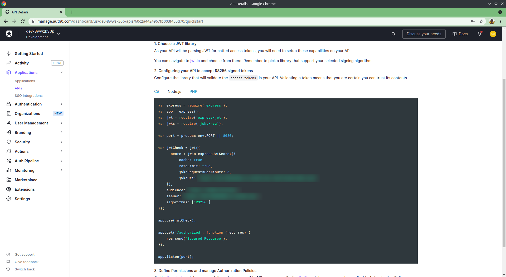
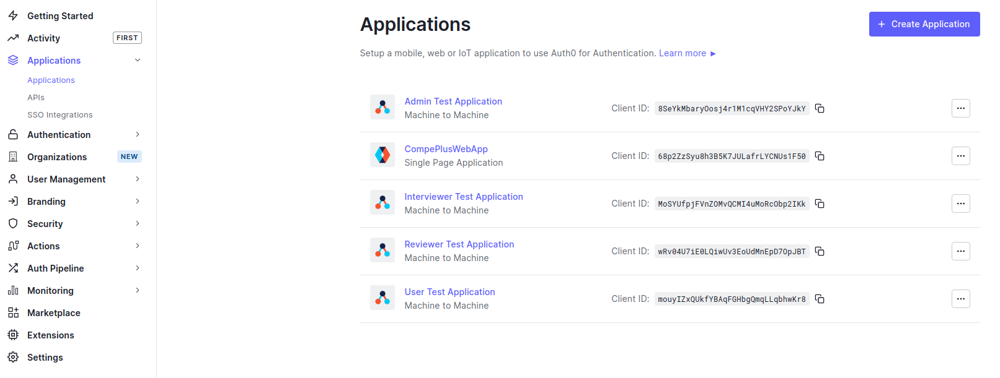
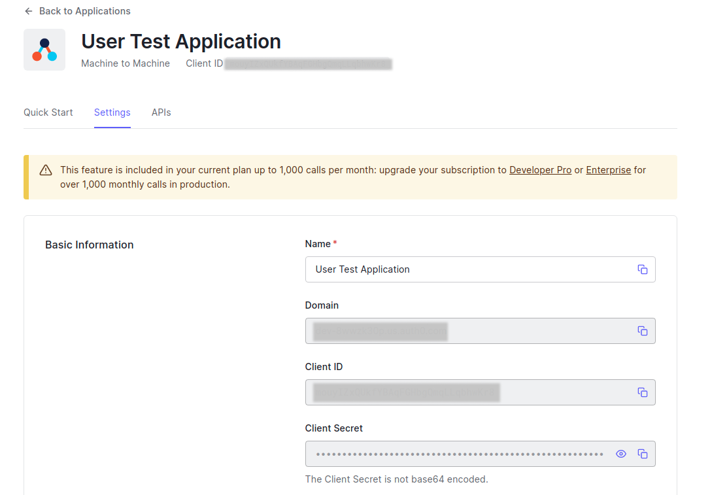

\*\*\*\*# CompE+ Backend

A REST API that supports the CompE+ [frontend](../www/README.md).

# Setup

Running `npm install` should download almost everything you need to get started.

# Local Development

To start a local development server run `npm run start:dev`. This will automatically pull in new changes as you update files.

To test the code run `npm test`. You can also run `npm run test:watch` for an interactive test session.

We also have a few scripts to keep the code quality up to snuff. Run `npm run format` to format all the code with Prettier and run `npm run lint` to make sure that ESLint doesn't complain about anything.

The API makes use of a number of services e.g., database, blog storage, email. See the [dependencies](#Dependencies) section for more on how to locally emulate these services.

## Environment variables

### Auth0

To find the three Auth0 fields open the Auth0 Dashboard and navigate to _CompePlusAPI_'s quick start tab. You should be able to find the NodeJS snippet.



# Authentication

All endpoints are protected by both authentication and authorization mechanisms. A JWT passed in a header like so `Authorization: Bearer <Your JWT Token>` is used for both of these purposes. For local testing you can generate this authentication header by running `npx ts-node tools/getAuth.ts <role>` from within the `api/` directory. With a bit of help from Bash command substitution curl requests become trivial:

```bash
curl localhost:1337/api/v1/resume-reviews -H "$(npx ts-node tools/getAuth.ts user)"
```

In order to use the `getAuth` tool you need to setup an `.env.tools` file. Follow along with `.env.tools.sample` for the format. The actual values can be found in the Auth0 dashboard.





# Logging recipes

```bash
# Verbose logging
VERBOSE=1 npm run start

# Pretty printed logging
npm run start | npx pino-pretty
```

# Deployment

TODO

# Dependencies

## PostgreSQL

The API needs to store its data in PostgreSQL. See [here](./db/README.md) for more details on running a DB locally, executing migrations, and more.

# Scripts

### `npm start`

Runs the compiled app with Node.

### `npm run start:dev`

Runs the app in the development mode. The server will reload if you make edits.

### `npm run build`

Builds the app for production to the `build` folder. Compiles the TypeScript into JavaScript.

### `npm run clean`

Removes the `build` folder.

### `npm test`

Excutes the tests with Jest.

### `npm run test:watch`

Starts an interactive test session with Jest. Tests will automatically re-run as you make edits.

### `npm run format`

Formats all of the source code.

### `npm run lint`

Runs ESLint across the codebase. Does not tolerate linter warnings.

### `npm run lint:fix`

Runs ESLint across the codebase and fixes errors.

### `npm run psql`

Shorthand to access local dev database.

# Schema Design

TODO: this should be replaced by a more thorough documenation in the future.

---

### `GET /users`

Read all users.

-   `?role=reviewer`

### `POST /users`

Create a new user (OAuth registration).

### `GET /users/{user}`

Read a single user.

### `GET /users/{user}/roles`

Read all roles for a user.

### `PUT /users/{user}/roles/{role}`

Create a new role for a user.

### `DELETE /users/{user}/roles/{role}`

Delete a role from a user.

---

### `GET /resume-reviews`

Read all resume reviews.

-   `?reviewer=XXXXXXXX-XXXX-XXXX-XXXX-XXXXXXXXXXXX`
-   `?reviewee=XXXXXXXX-XXXX-XXXX-XXXX-XXXXXXXXXXXX`
-   `?state=created`

### `POST /resume-reviews`

Create a new resume review.

### `GET /resume-reviews/{resume-review}`

Read a single resume review.

### `PATCH /resume-reviews/{resume-review}`

Update a resume review.

### `GET /resume-reviews/{resume-review}/documents`

Read all documents for a resume review.

-   `?is_review=true`
-   `?state=submitted`

### `POST /resume-reviews/{resume-review}/documents`

Create a new document for a resume review.

### `GET /resume-reviews/{resume-review}/documents/{document}`

Read a single document from a resume review.

### `PATCH /resume-reviews/{resume-review}/documents/{document}`

Update a document from a resume review.

---

### `GET /time-slots`

Read all time slots.

-   `?available=true`
-   `?after=2021-03-21T13:08:98Z`

### `POST /time-slots`

Create a new time slot.

### `DELETE /time-slots/{time-slot}`

Delete a time slot.

### `GET /interviews`

Read all interviews.

-   `?interviewer=XXXXXXXX-XXXX-XXXX-XXXX-XXXXXXXXXXXX`
-   `?interviewee=XXXXXXXX-XXXX-XXXX-XXXX-XXXXXXXXXXXX`
-   `?after=2021-03-21T13:08:98Z`

### `POST /interviews`

Create an interview.

### `DELETE /interviews/{interview}`

Delete an interview i.e. cancel it.
